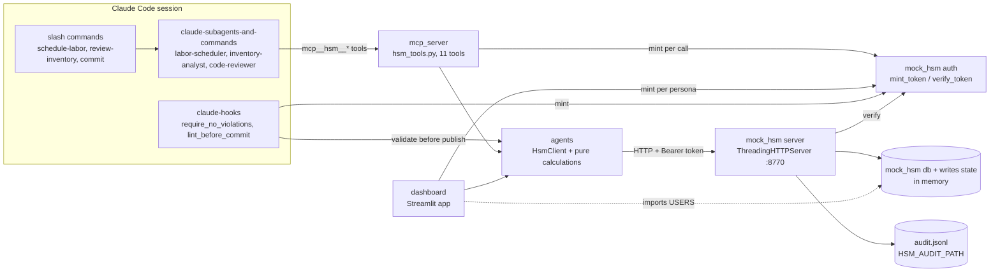
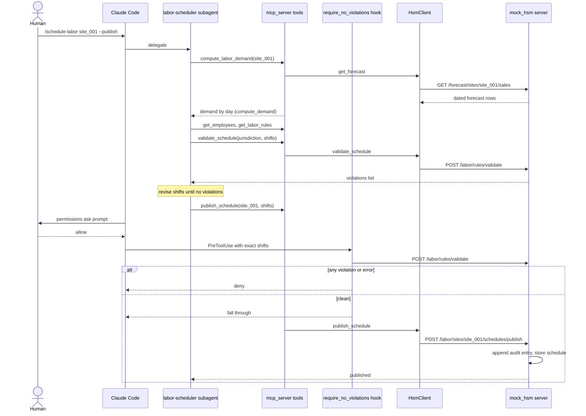
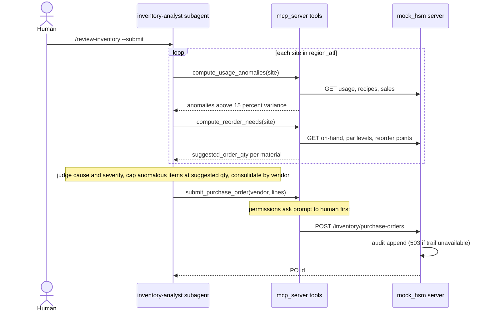
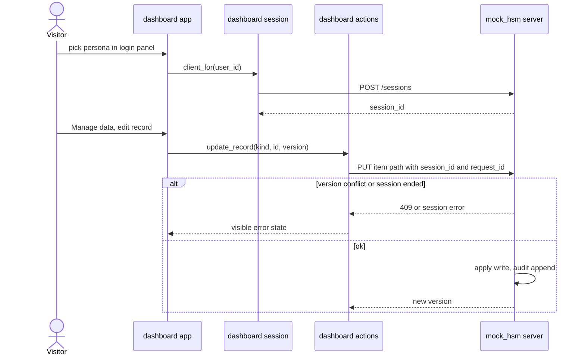

# Architecture: hsm-claude-code-cli

Commit `825a0f8`. Component names match `component-inventory.md`.

## System Overview

Three front ends share one backend contract:

- **Claude Code** (subagents → MCP tools in `mcp_server`) for the two agentic
  workflows.
- **The Streamlit dashboard** (`dashboard`) for people.
- **Claude Code hooks** (`claude-hooks`) that independently re-validate before
  a publish and lint before a commit.

All three reach the mock HSM backend (`mock_hsm`) only through the stdlib REST
client `HsmClient` (`agents`), carrying an HMAC bearer token minted per call
from a persona id. The backend verifies the token and enforces site/region
scope on every route except `GET /healthz`.

## Architectural Style

**Layered modular monolith, run as several local processes.** Evidence:

- One repository, no packaging (`sys.path.insert` of the repo root in four
  entry points), shared Python packages.
- Clear layers: front ends (`dashboard`, `mcp_server`, `claude-hooks`) →
  client and pure calculations (`agents`) → HTTP backend (`mock_hsm`).
- Processes today: the backend (`python3 -m mock_hsm.server`, 127.0.0.1:8770),
  the Streamlit app (127.0.0.1), the MCP server (stdio child of Claude Code),
  and short-lived hook subprocesses.
- The backend keeps all state in memory (`mock_hsm.db` collections and
  `mock_hsm.writes._state`); only the audit trail is on disk.

## Component Relationships

Text fallback: commands start subagents; subagents call MCP tools; MCP tools,
the dashboard and the publish hook all use `agents.HsmClient`, which calls the
backend over HTTP with a token minted by `mock_hsm.auth`; the backend verifies
the token, reads/writes in-memory state and appends to the audit file. The
dashboard also imports `mock_hsm.db.USERS` directly for its persona list.

## Data Flow

1. A front end chooses a persona id (`HSM_ACTIVE_USER` for MCP and hooks, the
   in-app picker for the dashboard).
2. `mock_hsm.auth.mint_token` signs a claims payload (persona, org, sites,
   region, one-hour TTL) with the module-level secret.
3. `HsmClient` (base URL from `HSM_BASE_URL`, frozen at import) sends the
   request with `Authorization: Bearer <token>`.
4. `mock_hsm.server.Handler` caps body size, verifies the token (401 on
   failure), matches the regex route table and runs the handler, which checks
   scope (403 outside it).
5. Read routes return seeded or in-memory data. Write routes go through
   `mock_hsm.writes` (sessions, versioned records) or the publish/PO handlers,
   and each one appends to the audit trail first; if the trail is unavailable
   publish/PO return 503.
6. Front ends feed fetched rows into `agents` pure functions
   (`compute_demand`, `compute_usage_anomalies`, `compute_reorder_needs`).

## Write Gating

Layered, for `publish_schedule` and `submit_purchase_order`:

1. `permissions.ask` rules in `.claude/settings.json` prompt the human.
2. `PreToolUse` hook `require_no_violations.py` re-runs validation on the exact
   `shifts` and denies on any violation or any exception (fails closed by
   design; a timed-out hook fails open, so the hook keeps a short budget).
   It uses `HSM_JURISDICTION` (default `GA`).
3. Hooks only deny or fall through; they never grant `allow`.
4. The dashboard has no publish or PO path at all, enforced by a test.

Note: hooks are registered in the gitignored `.claude/settings.local.json`, so
a fresh clone has no hook gate until the example is copied.

## Interaction Diagrams

### Labor scheduling with publish

### Inventory review with PO submit

### Dashboard data write

Text fallback: the labor flow loops validate until clean, then a publish passes
the human `ask` prompt and the independent hook re-validation before reaching
the backend. The inventory flow computes anomalies and reorder needs per site,
caps anomalous items and consolidates POs, then submits behind the `ask`
prompt. The dashboard write flow starts a backend session at login and sends
versioned writes with a session id; conflicts and ended sessions become
visible error states.

## Key Design Decisions (observed)

| Decision | Implication |
|---|---|
| Deterministic maths in `agents/`, judgment in subagents | Numbers are testable and repeatable; the LLM never invents them |
| Compliance decided server-side only | Hook and agent both defer to `/labor/rules/validate` |
| Stdlib-only backend and client | No runtime deps beyond Streamlit for hosting |
| Per-call token minting from a persona id | No login secret per user; the signing secret is the single trust root |
| Tool allowlists in subagent frontmatter | A new tool must be added there before a subagent can use it |
| In-memory backend state | Every restart resets demo data (conflicts with team.md; see `code-quality-assessment.md` CQ-5) |

## Improvement Opportunities (hosting intent)

Recorded once in `code-quality-assessment.md`: secret loading (CQ-1, CQ-2),
in-process backend start (CQ-4), identity gate (CQ-3), persistence (CQ-5).
