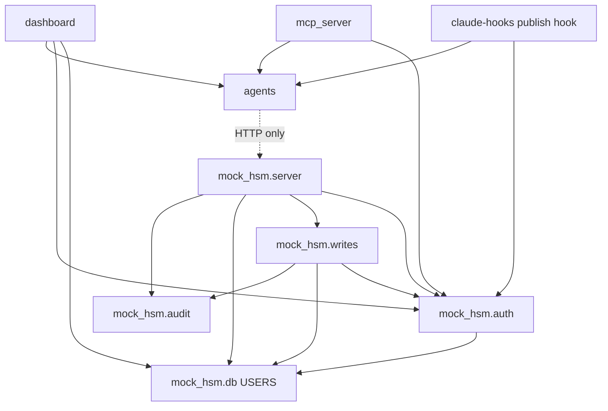

# Dependencies: hsm-claude-code-cli

Commit `825a0f8`. Versions are listed once in `technology-stack.md`.

## Internal Dependency Graph

Text fallback: `dashboard`, `mcp_server` and the publish hook import `agents`
and `mock_hsm.auth`; the dashboard also imports `mock_hsm.db.USERS`.
`mock_hsm.server` imports `audit`, `db`, `writes`, `auth`; `writes` imports
`audit`, `db`, `auth.site_allowed`; `auth` imports `db`. `agents` reaches the
backend only over HTTP. There are no import cycles.

### Coupling notes

- **Shared trust root.** Every process that mints or verifies a token reads
  `mock_hsm.auth._SECRET`: the dashboard (`session.client_for`,
  `dashboard/session.py:51-54`), the MCP server (`_client`,
  `mcp_server/hsm_tools.py:45-52`), the publish hook (line 70), the backend
  (`verify_token`, `server.py:718`), about 10 test modules calling
  `mint_token` in-process, and the hook/MCP subprocess tests. Changing how the
  secret is loaded touches all of them (CQ-1).
- **Import-order coupling.** `tests/conftest.py` imports `mock_hsm.writes` at
  module top (line 17), which imports `auth`. Anything `auth` reads at import
  is read before any fixture runs (CQ-1).
- **Environment propagation.** Subprocess tests copy `os.environ`
  (`test_hooks.py` `_run_hook`, `test_mcp_tools.py:53`), so a variable set
  early in `conftest.py` reaches them.
- **Dashboard ships with `mock_hsm`.** The `USERS` and `mint_token` imports
  mean the two packages deploy together (affirmed in `team.md` Code Style).

## External Dependencies

### Runtime (`requirements.in` → `requirements.txt`, installed by Streamlit Cloud)

- `streamlit==1.64.0` and its transitive set (pandas, altair, pyarrow,
  numpy, starlette, uvicorn, protobuf, pillow, requests, ...), all
  hash-pinned with Python-version markers.
- Backend and client add nothing: stdlib only.

### Development (`requirements-dev.in`, includes `-r requirements.in`)

- `mcp[cli]==1.30.0`, `ruff==0.16.8`, `pytest==9.1.1`,
  `pytest-rerunfailures`, `coverage`, `bandit`, `pip-audit`, `cvss`,
  `tomli; python_version < "3.11"`.
- The MCP server's runtime dependency lives only here. Acceptable: the hosted
  app never runs the MCP server.

### Missing for the hosting intent

- `Authlib` (the `streamlit[auth]` extra) for `st.login`: add to
  `requirements.in`, recompile both locks.
- `playwright` in `requirements-dev.in`, plus a
  `playwright install --with-deps chromium` step in `browser-tests`.
- Detail and gate impact: `code-quality-assessment.md` CQ-6.

## Dependency Management Rules (affirmed)

- Edit only the `.in` files; recompile with the `uv pip compile` command at
  the top of each. `lock-check` fails on drift.
- Install with `pip install --require-hashes`.
- `pip-audit` gates high/critical findings; waivers only in
  `security-exceptions.toml` with a reason and an expiry at most 90 days out.
- `.github/dependabot.yml` proposes updates.
