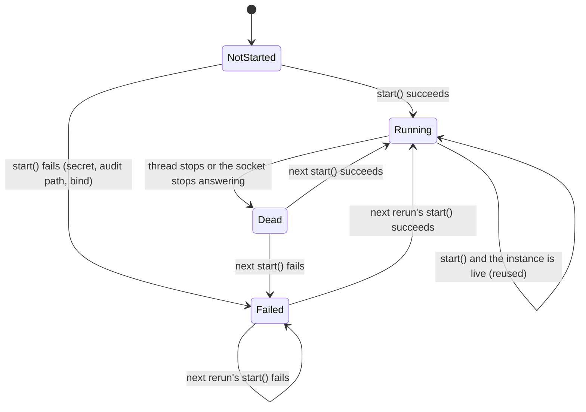
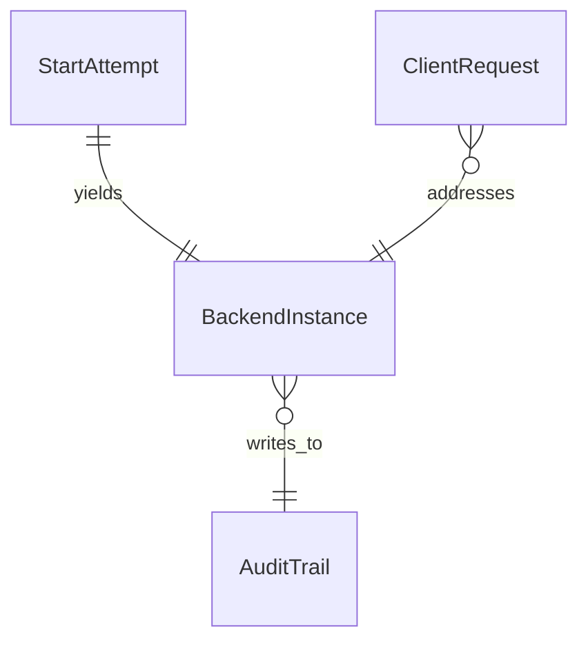

# Functional Specification — U2 embedded-backend

## Sources

- `inception/units-generation/unit-of-work.md` U2; `unit-of-work-story-map.md` (US3.1 → US3.2 → US3.4 → US3.3)
- `inception/contract-design/contract-summary.md` C2, C3
- `inception/domain-design/components.md` and `reviews/review-01.md` R-01–R-03
- `inception/refined-mockups/mockups.md` Screen 4 and `interaction-spec.md` step 3
- `entities.md` and `rules.md` in this directory; `functional-design-questions.md` Q1–Q4

## Scope

The dashboard runs the mock backend inside its own process, one per process, bound to loopback. The dashboard always uses that backend. The separately started backend stays for the MCP server and the hooks. Screen 4's "Sign out" comes from U3; until U3 lands, Screen 4 renders without the Account section, and the "Sign out" half of AC3.3.2 is verified by U3's tests.

**Dashboard call sites that change** (BR4.1): `dashboard/session.py` `client_for` (today it relies on the client's default address); `dashboard/app.py` — its import of `HSM_BASE_URL`, the sidebar backend caption, and the "can't reach the HSM backend" error text in `run()`. No other dashboard module builds a backend client; a test asserts no dashboard module imports `HSM_BASE_URL`.

**Render order** (BR5.4): on every rerun, the secrets bridge and sign-in gate (U3), then the backend start, then the screens. Until U3 lands, the backend start is the first step of the render.

**Refinement of contract C2:** C2 named `<system temp dir>/hsm-audit.jsonl` as the embedded default. Because the audit module narrows its parent directory's permissions, the default becomes `<system temp dir>/hsm-demo-<user id>/audit.jsonl` in an app-owned directory (BR3.2).

## Workflows

### W1 — Start or reuse the backend (every rerun, after the sign-in gate allows)

1. DashboardShell calls `start()` with the default port.
2. The start function takes the process-wide lock (BR2.1).
3. If a previous instance exists and is live (thread alive and a TCP connect succeeds, BR2.2), release the lock and return it, ignoring any port argument. Outcome: reused.
4. If a previous instance exists but is not live, shut it down, close its socket, and log that the backend was replaced and its demo data reset (BR2.4).
5. Check the signing secret (BR3.1). On refusal, record a failed instance with the reason as its cause and go to step 10.
6. Resolve the audit path (BR3.2), creating the private directory when needed, and configure the audit trail. Then read back the audit module's unavailable reason (BR3.3). If one is present (OS error or corrupt trail), record a failed instance with it as the cause and go to step 10.
7. Bind `127.0.0.1` on the requested port, or a free one (BR1.1). If binding fails, record a failed instance and go to step 10.
8. Serve in a daemon thread.
9. Record a running instance (address, port, start time). Outcome: started.
10. Release the lock and return the instance. Never retry within this call (BR2.3).

### W2 — Render after the start

1. If the instance is running and replaced a dead one in this rerun, clear the dashboard's cached reads (BR2.5). Then render the normal signed-in frame. The backend caption reads the live instance's address at render time (BR5.3, BR2.5).
2. If the instance failed, write its cause to the log (BR5.2) and render Screen 4 only (BR5.1).
3. The next rerun repeats W1, which makes at most one new attempt.

### W3 — Get a client for a persona

1. A dashboard call asks for a client for a user, usually without a base address.
2. If a base address was passed, use it.
3. Otherwise, take the address of the live instance at this moment (BR4.1, BR2.5).
4. If no instance is live, raise an error stating that the embedded backend is not running (BR4.2). Never start one here.
5. Mint the persona token and return the client.

### W4 — Separate-process backend (unchanged)

1. `python3 -m mock_hsm.server` (or the start script) runs as before. It reads `.env.local`, refuses without a secret, and serves on its port with the default local audit path.
2. The MCP server and hooks reach it through `HSM_BASE_URL` as before (BR6.1). The dashboard does not use it.

## State Machine — BackendInstance (per process)

Text fallback: NotStarted → Running or Failed on the first start. Running stays Running while live. A dead instance is detected by the next call and replaced by one new attempt, which ends Running or Failed. Failed is left only by a later rerun's single attempt.

## Error Handling

| Cause | Outcome | Visitor sees | Log |
|-------|---------|--------------|-----|
| Missing, short or burned secret | Failed | Screen 4 | the refusal reason (never the value) |
| Audit path not writable (OS error) | Failed | Screen 4 | the audit module's unavailable reason |
| Existing audit trail is corrupt | Failed | Screen 4 | the audit module's unavailable reason |
| Port bind fails | Failed | Screen 4 | the OS error |
| Instance died | old instance closed, one new attempt per W1 | Screen 3 (cached reads cleared) or 4 | a "backend replaced, demo data reset" warning plus the new outcome |
| `client_for` with no live backend | error raised | the existing error handling of the calling screen | the error |

## Entity-Relationship View (derived from `entities.md`)

## Rules Summary (derived from `rules.md`)

- Loopback only, standard library only (BR1.1, BR1.2).
- One live backend per process; live means thread alive and socket answering; one attempt per call; a dead instance is closed before replacement and the address is read at each use (BR2.1–BR2.5).
- No secret, or an unusable audit trail read back after configuring, means a failed start; the default audit path is a private app-owned directory (BR3.1–BR3.3).
- The client's address comes only from the live instance; none live is an error (BR4.1, BR4.2).
- Failure shows only Screen 4 and logs the cause; the caption shows the real address; the start runs every rerun after the gate (BR5.1–BR5.4).
- The separate backend is unchanged (BR6.1).

## Assumptions & Open Questions

None.
