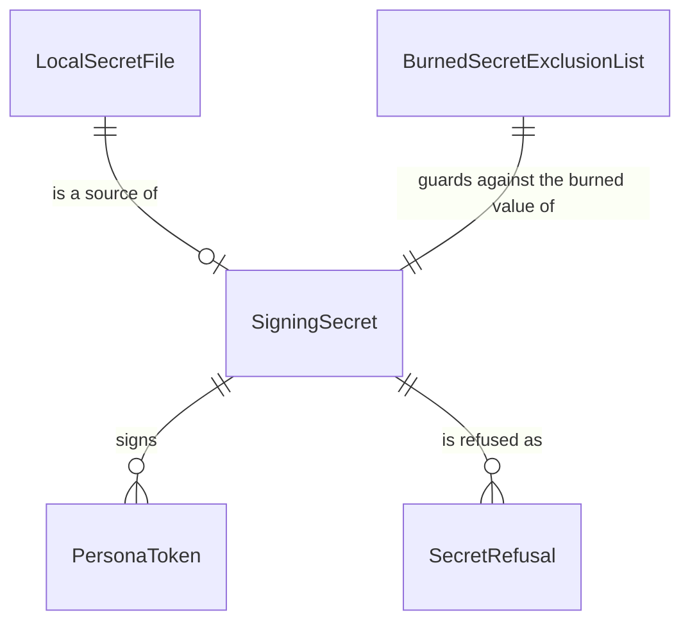

# Functional Specification — U1 secret-fail-closed

## Sources

- `entities.md`, `rules.md` (source of truth for data shape and decision logic)
- `inception/units-generation/unit-of-work.md` (U1); `unit-of-work-story-map.md` (U1 order constraints: the hook deny test first, the literal removed last)
- `inception/contract-design/contract-summary.md` C1, C2
- `functional-design-questions.md` Q1–Q4

## Scope

U1 removes the burned signing secret and makes every process fail closed without a valid one. It is pull request 1 and the walking-skeleton slice. The slice is proven when that pull request merges with all 10 required checks green and every entry point refuses to run without a secret while working with one.

## Workflows

### W1 — Getting the secret (any token operation)

1. The caller asks to mint or verify a token, or calls `require_secret()` at startup (BR1.1).
2. Read `HSM_SIGNING_SECRET` from the environment at this moment.
3. If it is unset or empty, refuse with reason `missing` (BR1.3). If it is under 32 UTF-8 bytes, refuse with reason `too_short` (BR1.4). The message names the variable and never contains the value (BR1.5).
4. Otherwise use the value to sign or check the token. Nothing is cached between calls, and there is no default (BR1.6).

### W2 — Local secret loading (separate-process backend, hook, MCP tool server)

1. The process starts.
2. If `HSM_SIGNING_SECRET` is already set, leave it (BR3.1).
3. Otherwise, if `.env.local` exists in the project root, read its `HSM_SIGNING_SECRET=` line and set the variable for this process only. If the file or the line is absent, do nothing.
4. Continue to the entry point's own check (W3–W6).

### W3 — Separate-process backend start (`python3 -m mock_hsm.server`)

1. Run W2.
2. Call `require_secret()`. On a refusal, print the message and exit non-zero; no server starts (BR3.4).
3. Otherwise start as today.
4. While serving, any request whose token verification raises a secret refusal gets HTTP 503 with a JSON error naming `HSM_SIGNING_SECRET`, and the backend keeps serving (BR3.5).

### W4 — Start script (`scripts/start_mock_server.sh`)

1. If `HSM_SIGNING_SECRET` is unset and `.env.local` exists, load it into the environment.
2. If the secret is still missing or under 32 bytes, print a message naming `HSM_SIGNING_SECRET` and exit non-zero (BR3.3).
3. Otherwise launch the backend (W3), on the port setting if one is given, or the default port otherwise. Tests always pass a free port.

### W5 — Publish hook

1. Run W2.
2. Call `require_secret()` before any validation. On a refusal, return a deny whose reason names the missing secret (BR4.1).
3. Otherwise mint a token and re-validate as today. A compliant schedule falls through to the normal permission prompt.

### W6 — MCP tool call

1. At server start, run W2.
2. On each tool call, the token mint calls `require_secret()`. On a refusal, return a tool error naming `HSM_SIGNING_SECRET` (BR4.2).

### W7 — Dev-secret script (`scripts/dev-secret.sh`)

1. If `.env.local` already has `HSM_SIGNING_SECRET` and `--force` was not given, exit non-zero and change nothing (BR3.2).
2. Otherwise generate a fresh value of at least 32 bytes and write `HSM_SIGNING_SECRET=<value>` to `.env.local`, keeping any other lines.
3. The file is git-ignored (BR5.1).

### W8 — Test session

1. When `tests/conftest.py` loads, generate a fresh secret of at least 32 bytes and set `HSM_SIGNING_SECRET` before anything starts (BR2.2).
2. Subprocess tests inherit it. Two calls of the generator return different values.

### W9 — Removing the burned literal (the last change in the unit)

1. Precondition: W1–W8 are in place and tested.
2. In one commit, delete the literal from `mock_hsm/auth.py`, empty `TEMPORARY_EXCLUSIONS`, and add the regression tests (BR2.1).
3. The burned-secret check passes in CI.

## State Machine — SigningSecret availability for one process

| Current state | Event | Guard | Next state | Action |
|---------------|-------|-------|------------|--------|
| Unknown | Process start | Variable set | Present | — |
| Unknown | Process start | Variable unset, `.env.local` has entry | Present | Set variable from the file (W2) |
| Unknown | Process start | Variable unset, no file entry | Absent | — |
| Present | Token operation | Value at least 32 bytes | Present | Sign or verify |
| Present | Token operation | Value under 32 bytes | Refused | Raise `too_short` |
| Absent | Token operation or `require_secret` | — | Refused | Raise `missing` |
| Refused | Surface | Entry point type | Refused | Exit non-zero, deny, tool error or 503 (per W3–W6) |

The secret is re-read on every token operation, so a process can move from Present to Refused if its environment changes. The backend reports that per request (W3 step 4).

## Entity Relationships (derived from entities.md)

Text version:
- One SigningSecret signs many PersonaTokens.
- A LocalSecretFile is one possible source of the SigningSecret.
- A missing or short SigningSecret produces a SecretRefusal.
- The BurnedSecretExclusionList guards against the old burned value.

## Rules Summary (derived from rules.md)

- **Reading the secret (BR1.1–BR1.6):** read when used, standard library only, at least 32 bytes, never echoed, no fallback.
- **Removal and tests (BR2.1–BR2.2):** the literal and exclusion go together; tests bring their own secret.
- **Local start (BR3.1–BR3.5):**
  - `.env.local` is used only when the variable is unset;
  - the dev-secret script refuses to overwrite without `--force`;
  - the start script and the backend refuse without a secret;
  - a running backend answers 503 when the secret fails mid-run.
- **Claude-launched tools (BR4.1–BR4.2):** the hook denies explicitly, and the tools return a clear error.
- **Repository hygiene (BR5.1, BR5.2, BR6.1):** explicit ignore lines, `noqa` reasons, and docs updated with each change.

## Error Catalogue

| Condition | Surface | Message content |
|-----------|---------|-----------------|
| Secret missing | exception / exit / deny / tool error / 503 | "HSM_SIGNING_SECRET is not set …" plus how to create it (the dev-secret script) |
| Secret too short | same | "HSM_SIGNING_SECRET must be at least 32 bytes …" |
| `.env.local` already has a secret | dev-secret script exit | "…already set; use --force to replace it" |

## Assumptions & Open Questions

- The `.env.local` parser accepts only simple `KEY=VALUE` lines, without shell expansion. That is enough for the file the dev-secret script writes. Lines it doesn't understand are ignored, not executed.
