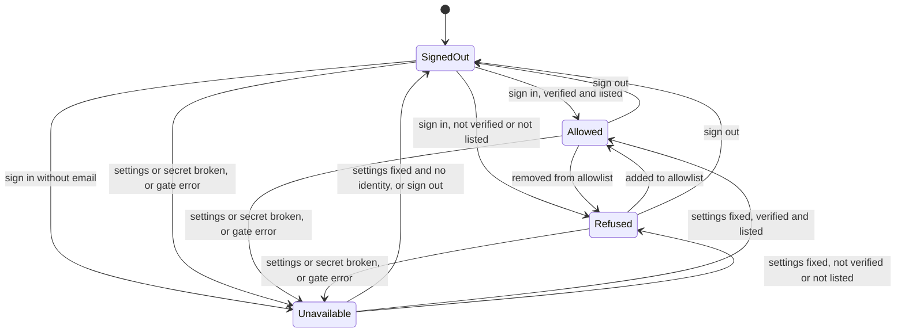
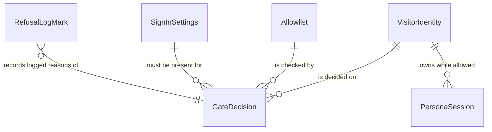

# Functional Specification — U3 sign-in-gate

## Sources

- `inception/units-generation/unit-of-work.md` (U3) and `unit-of-work-story-map.md` (US2.5, US4.1–US4.8, US8.1)
- `inception/requirements-analysis/requirements.md` FR2.1, FR4.1–FR4.10, FR8.1, NFR1, NFR4, NFR5
- `inception/domain-design/components.md` (SecretsBridge, SignInGate, DashboardShell)
- `inception/contract-design/contract-summary.md` C1, C3, C4, C5, C6, C7
- `inception/refined-mockups/mockups.md` Screens 1–5
- `entities.md` and `rules.md` in this directory (source of truth for data shape and decision logic)
- `functional-design-questions.md` Q1–Q4 (answered A, A, A, B; summary confirmed)

## Scope

This unit puts a sign-in gate in front of the whole dashboard and copies the hosted signing secret into the environment. On every rerun the order is:
1. The secrets bridge runs.
2. The gate decides.
3. Only if the gate allows: the embedded backend starts or is reused (U2), and the signed-in frame renders.

The unit owns Screens 1, 2 and 5, the Account section on Screens 3 and 4, sign-out, the refusal log and the markers module. The existing tabs and the persona login are unchanged, except that the persona login moves under a "Demo persona" heading and its caption reads "Acting as".

Out of scope:
- the backend start and Screen 4's body (U2);
- the banner and build caption slots (U4);
- the browser tests and the post-deploy check (U5);
- entering real hosted secrets (U6).

## Workflows

### W1 — Every rerun (the startup order)

0. **Render the shared page header (BR4.4).** The page setup, which Streamlit requires as its first call, runs first, then the h1 "HSM labor & inventory". This happens on every path, so every screen has exactly one h1, and no later step may call the page setup.
1. **Bridge the signing secret (BR1.1, BR1.5).** Read the hosted secrets. If they can't be read, treat every hosted key as absent. If the environment has no `HSM_SIGNING_SECRET` and the hosted secrets have one, copy it in.
2. **Check the signing secret (BR1.2, BR1.3).** Run the shared secret check. If it fails, or the secret equals a configured `cookie_secret`, the decision is `refuse_unavailable` / `settings_missing`. The log names the setting or settings, never the values. Go to step 7.
3. **Check the sign-in settings (BR2.1).** All five keys must be non-empty strings. Otherwise the decision is `refuse_unavailable` / `settings_missing`. Go to step 7.
4. **Parse the allowlist (BR2.2).** Anything but a non-empty list of non-blank strings means `refuse_unavailable` / `allowlist_invalid`. Go to step 7.
5. **Read the identity** through the seam (BR7.1).
6. **Decide (BR3.1–BR3.5),** using the pure decision function on the identity and the parsed allowlist:
   - not signed in: `refuse_visitor` / `not_signed_in`;
   - signed in without an email: `refuse_unavailable` / `gate_error`;
   - not verified (anything but boolean `true`): `refuse_visitor` / `not_verified`;
   - email not on the allowlist after trimming and lower-casing: `refuse_visitor` / `not_listed`;
   - otherwise: `allow` / `ok`.
7. **Log a refusal (BR6.1, BR6.2).** If the reason is anything other than `ok` or `not_signed_in`, and this browser session hasn't logged that reason yet, write one line with the reason and record it as logged.
8. **Render.**
   - Refusals: render the gate screen for the decision (W2) and end the rerun. Nothing else renders (BR4.1).
   - Allow: first, if this browser session's state is bound to a different account email, run `end_visitor_session` and bind the state to the new email (BR5.2). Then hand control back to DashboardShell, which starts or reuses the backend (U2) and renders Screen 3, or Screen 4 if the backend failed. Both screens start the sidebar with the Account section (BR4.6).

**Any exception in steps 1–8 that belongs to the gate** (reading settings, parsing, reading the identity, deciding, rendering a gate screen) turns the decision into `refuse_unavailable` / `gate_error`. Screen 5 renders, the log records the error type only, and the rerun ends (BR3.7). The persona picker never renders on this path.

### W2 — Render a gate screen

| Decision | Screen | Content | Action |
|----------|--------|---------|--------|
| `refuse_visitor` / `not_signed_in` | Screen 1 | h1 "HSM labor & inventory"; "Access to this demo is by invitation." | "Sign in with Google" (W3) |
| `refuse_visitor` / `not_verified`, `not_listed` | Screen 2 | h1; "This account doesn't have access."; "Signed in as: " + email as literal text | "Sign out" (W4) |
| `refuse_unavailable` / any reason | Screen 5 | h1; "Sign-in isn't available right now."; "Reload the page or try again later." | "Sign out" (W4) only if a guarded identity read on this screen reports a signed-in identity (BR4.3) |

- Every screen has exactly one h1 (from step 0), text-only messages and a standard button (BR4.4).
- Screen 5 reads the identity through the seam in its own guarded call, on every path that reaches it. That includes the secret, settings and allowlist failures, where step 5 never ran. If the read fails, no Sign out button is shown, and "Reload the page or try again later." is the way out (BR4.3).
- Each screen container and button carries its marker (BR4.7).
- The sidebar shows no persona or site controls on these screens.

### W3 — Sign in

1. The visitor chooses "Sign in with Google" on Screen 1.
2. The seam starts Google sign-in (BR4.5). The browser leaves for Google and returns to the app's callback, which Streamlit owns.
3. The next rerun runs W1 with the new identity:
   - a cancelled or failed sign-in leaves the visitor signed out, so Screen 1 shows again (BR3.1);
   - an expired session does the same.

### W4 — Sign out

Available on Screens 2, 3, 4 and 5 (Screen 5 only when signed in).

Sign-out is two parts, so a test that replaces the seam still runs the state clearing (BR5.1, BR7.1).

1. **`end_visitor_session` (a plain function outside the seam):**
   1. If a persona login holds a backend session, ask the backend to end it. This is best effort. Only the backend-not-running error (for example, signing out from Screen 4), the backend-unavailable error and backend API errors are swallowed, and a failure is logged without the session id.
   2. Clear every dashboard key of this browser session:
      - the persona login and the notice;
      - every login-scoped item: held writes, pending delete and retry, audit page, request ids, templates, record cache;
      - the record-form widget keys;
      - the record of which refusals were logged;
      - the account binding (BR5.2).

   It does not reuse the existing persona "Log out" action, because that action sets a "You logged out." notice.
2. **The seam's `sign_out`:** wraps only the provider sign-out. If it raises (for example, the sign-in settings are broken), the state stays cleared, and the error is logged as `gate_error`.
3. The next rerun runs W1:
   - with no identity, Screen 1 shows;
   - with broken settings, Screen 5 shows.

   A different account signing in on the same tab starts with no persona selected (AC4.6.3). This also holds when the first account's Google session simply expired without Sign out (BR5.2).

C4 describes `sign_out()` as "clears the persona session, then st.logout()". This design keeps that order of effects but places the clearing in `end_visitor_session`, which the Sign out button calls before the seam.

### W5 — The signed-in frame (Screens 3 and 4, the Account section only)

1. The sidebar starts with the "Account" heading, the email as literal text, and "Sign out" (BR4.6).
2. On Screen 3 only:
   - a divider, then the "Demo persona" heading;
   - the existing persona login and site picker, unchanged;
   - the persona caption reads "Acting as {name} ({persona})".
3. Screen 4 shows only the Account section, plus U4's build caption.

## State Machine — VisitorAccess (per browser session)

| State | Meaning | Screen |
|-------|---------|--------|
| `Unavailable` | The signing secret, settings or allowlist is unusable, or the gate errored | 5 |
| `SignedOut` | No identity | 1 |
| `Refused` | Signed in, but not verified or not on the allowlist | 2 |
| `Allowed` | Signed in, verified and listed | 3 (or 4 if the backend failed) |

The state is recomputed from scratch on every rerun (W1). Nothing about access is cached between reruns, so an allowlist or settings change takes effect on the next interaction.

| From | Event | To |
|------|-------|----|
| any | secret, settings or allowlist check fails, or the gate errors | `Unavailable` |
| any | the checks pass and the seam reports no identity | `SignedOut` |
| `SignedOut` | Google sign-in succeeds; email present, not verified or not listed | `Refused` |
| `SignedOut` | Google sign-in succeeds; email present, verified and listed | `Allowed` |
| `SignedOut` | Google sign-in succeeds, no email | `Unavailable` |
| `Refused`, `Allowed`, `Unavailable` (signed in) | Sign out (W4) | `SignedOut` |
| `Allowed` | the email is removed from the allowlist | `Refused` (next rerun) |
| `Refused` | the email is added to the allowlist | `Allowed` (next rerun) |
| `Unavailable` (signed in) | the secret, settings and allowlist are fixed; the identity is verified and listed | `Allowed` (next rerun) |
| `Unavailable` (signed in) | the secret, settings and allowlist are fixed; the identity is not verified or not listed | `Refused` (next rerun) |
| `Unavailable` | the secret, settings and allowlist are fixed; no identity | `SignedOut` (next rerun) |
| `Allowed` | a different allowed account signs in on the same tab | `Allowed`, with the previous account's persona cleared (BR5.2) |

Text fallback: the four states are `SignedOut` (Screen 1), `Refused` (Screen 2), `Allowed` (Screen 3 or 4) and `Unavailable` (Screen 5). A broken secret, broken settings, an invalid allowlist or a gate error move any state to `Unavailable`. Sign out returns any signed-in state to `SignedOut`. A Google sign-in moves `SignedOut` to `Allowed`, `Refused` or (without an email) `Unavailable`. Allowlist edits move a visitor between `Allowed` and `Refused` on the next rerun. Once the settings are fixed, a signed-in visitor in `Unavailable` moves to `Allowed` or `Refused`, and a visitor with no identity moves to `SignedOut`.

## Error Handling

| Situation | Decision | Screen | Log |
|-----------|----------|--------|-----|
| No signing secret anywhere, or shorter than 32 bytes | `refuse_unavailable` / `settings_missing` | 5 | Names `HSM_SIGNING_SECRET`, never the value |
| Signing secret equals `cookie_secret` | `refuse_unavailable` / `settings_missing` | 5 | Names both settings, neither value |
| No hosted secrets file, or one that doesn't parse | treated as absent | 5 (through settings or secret check) | `settings_missing` |
| A sign-in key missing or blank | `refuse_unavailable` / `settings_missing` | 5 | `settings_missing` |
| Allowlist missing, not a list, empty, or with a bad entry | `refuse_unavailable` / `allowlist_invalid` | 5 | `allowlist_invalid` |
| Signed in without an email | `refuse_unavailable` / `gate_error` | 5 with Sign out | `gate_error` |
| Any exception in the gate | `refuse_unavailable` / `gate_error` | 5 (Sign out if an identity could be read) | `gate_error` and the error type |
| Not verified | `refuse_visitor` / `not_verified` | 2 | `not_verified` |
| Not on the allowlist | `refuse_visitor` / `not_listed` | 2 | `not_listed` |
| Ending the backend session at sign-out fails (backend not running, unavailable, or an API error) | sign-out continues | 1 next | Failure noted without the session id |
| The provider sign-out itself fails (for example, broken sign-in settings) | state already cleared | 5 or 1 next | `gate_error` |
| Screen 5's identity read fails | no Sign out shown | 5 | `gate_error` |

Each reason is logged once per browser session (BR6.2). No log line or screen ever carries an email, a secret value or an allowlist entry (BR6.1, BR6.3).

## Entity-Relationship View (derived from `entities.md`)

Text fallback:
- each GateDecision refers to one VisitorIdentity, checked against one Allowlist and one SignInSettings;
- a PersonaSession belongs to the allowed identity and is cleared at sign-out;
- RefusalLogMark records which refusal reasons were already logged in this browser session.

## Rules Summary (derived from `rules.md`)

- **Secrets (BR1.1–BR1.5):**
  - the hosted signing secret is copied only when the environment lacks one, and must then pass the shared check;
  - it must differ from the cookie secret;
  - unreadable hosted secrets count as absent;
  - Streamlit code stays in `dashboard/`.
- **Settings and allowlist (BR2.1–BR2.3):** all five sign-in keys are required; the allowlist is a non-empty list of non-blank strings, matched exactly after trimming and lower-casing.
- **Decision (BR3.1–BR3.7):**
  - the decision is a pure function, and the checks run in a fixed order;
  - only a boolean `true` verified flag and an exact allowlist match allow;
  - no email, or any error, means Screen 5.
- **Screens (BR4.1–BR4.7):**
  - nothing but the gate screen renders unless the visitor is allowed;
  - each screen keeps fixed copy, one h1 and a keyboard-reachable action;
  - the Account section comes first in the sidebar;
  - markers are plain constants.
- **Sign out (BR5.1, BR5.2):**
  - a plain function ends the backend session (best effort) and clears the state;
  - the seam then signs out of Google;
  - a different allowed account clears the previous account's persona.
- **Logging (BR6.1–BR6.3):** one line per reason per browser session, never an email or a secret.
- **Testing seam (BR7.1):** the seam is the only sign-in API caller and holds nothing else, so tests use a shared fake allowed identity and still exercise the state clearing.

## Assumptions & Open Questions

- [assumption] Google reports `email_verified` as a boolean through Streamlit's user object (feasibility risk R1). If it doesn't, every visitor is refused with `not_verified`, which is the fail-closed outcome. Code Generation confirms this with a real local sign-in (delivery planning B3).
- [assumption] Streamlit's sign-out ends the Google session cookie for this app only; it doesn't sign the visitor out of Google itself.
- [assumption] The backend's session-end route accepts the persona's session id as today (`POST /sessions/{id}/logout`). The dashboard-writes work defines it, and this unit doesn't change it.
