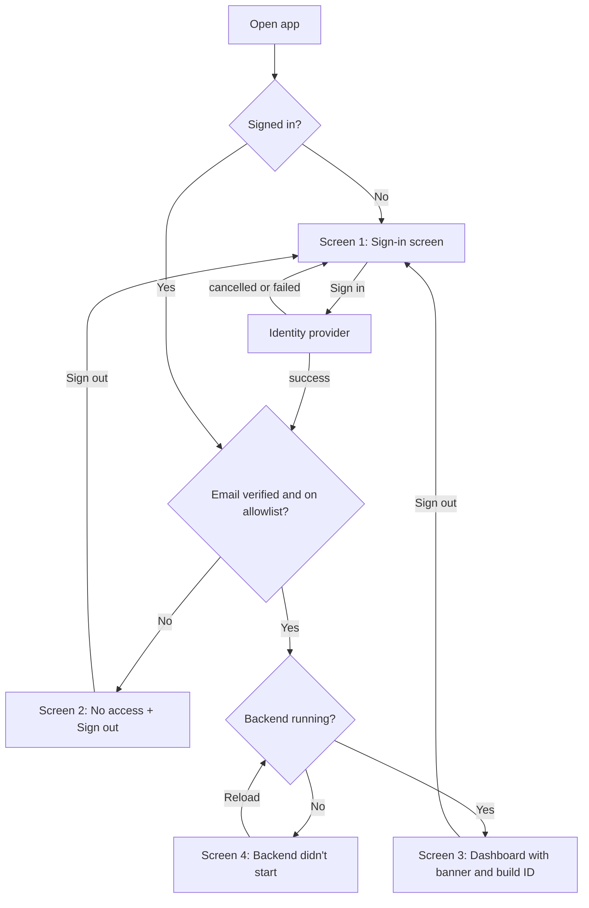

# User Flow — Dashboard Hosting Readiness

## Sources

- Answers Q1–Q7 in `ideation/rough-mockups/rough-mockups-questions.md`
- Wireframes: `ideation/rough-mockups/wireframes.md`

## Flow: Reaching the hosted dashboard

- **Persona:** a visitor to the hosted app. Today that's you (intent capture Q5), plus anyone you add to the allowlist.
- **Trigger:** opening the app's address.

Text version:
1. Screen 1 (signed out) → select "Sign in" → the identity provider's sign-in. A cancelled or failed sign-in returns to Screen 1.
2. After sign-in, the app checks that the email is verified and on the allowlist. If either check fails → Screen 2 → "Sign out" → Screen 1.
3. If both checks pass, the app checks that the backend is running. If it isn't → Screen 4 → reload to retry.
4. If the backend is running → Screen 3: the dashboard with the reset banner and build identifier. The existing persona login and tabs work as they do today.
5. "Sign out" from Screen 3 → Screen 1.

**Success outcome:** an allowed visitor sees the dashboard with the reset banner always visible and the build identifier in the sidebar.

**Error paths:**
- A cancelled or failed sign-in → back to Screen 1.
- Not verified or not on the allowlist → Screen 2, which reveals nothing about who is allowed.
- The backend didn't start → Screen 4, with a plain message and a way out (reload or sign out).

## Information Architecture

- Sign-in layer (Screens 1 and 2): no dashboard content at all.
- Signed-in app (Screen 3):
  - Sidebar: the signed-in block (email, "Sign out"), then the existing persona login and site picker, then the captions (backend, build).
  - Main: the title, the reset banner, the site caption, then the existing five tabs.
- Failure state (Screen 4): it replaces the main area; the sidebar's "Sign out" stays.

## Assumptions & Open Questions

None.
