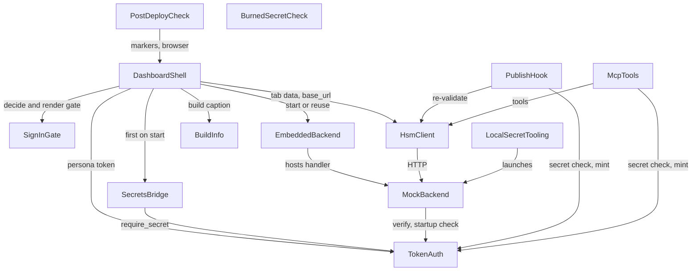

# Component Catalogue — Dashboard Hosting Readiness

## Sources

- `inception/requirements-analysis/requirements.md`; `inception/user-stories/stories.md` (US1.1–US10.1); `inception/refined-mockups/mockups.md`, `interaction-spec.md`
- Code knowledge base at `825a0f8`: `architecture.md`, `component-inventory.md`, `code-quality-assessment.md` (CQ-1 to CQ-12)
- `memory/team.md` Code Style (file placement, layer boundaries); answers Q1–Q5 in `domain-design-questions.md`

Scope: the building blocks this work adds or changes. Existing components it doesn't touch (the calculation agents, the Labor Rules route, the writes and audit internals, the subagents) are left out. Infrastructure (Streamlit Cloud, Google sign-in, GitHub Actions, Chromium) is an external dependency, never a component.

```yaml
components:
  - name: TokenAuth
    summary: Signing-secret loading and token mint/verify (mock_hsm/auth.py)
    behaviour: >
      Reads HSM_SIGNING_SECRET from the environment at each mint or verify call, never at import.
      Refuses a missing secret or one shorter than 32 UTF-8 bytes with an error naming the variable and never the value.
      Exposes require_secret() so every entry point can fail closed at startup. Contains no secret literal and no fallback.
      Imports only the standard library and mock_hsm.
    responsibilities:
      - Load and validate the signing secret at call time
      - Mint and verify persona tokens
      - Provide the shared require_secret() startup check
    depends_on: []
    dependents:
      - component: MockBackend
        interaction: verifies tokens on every request and checks the secret at startup
      - component: SecretsBridge
        interaction: calls require_secret() after copying the hosted secret into the environment
      - component: DashboardShell
        interaction: mints persona tokens for the signed-in session
      - component: PublishHook
        interaction: mints a token to re-validate a publish; checks the secret first
      - component: McpTools
        interaction: mints a token per tool call; checks the secret first
    external_dependencies: []
    entities:
      - name: PersonaToken
        identifier: token
        attributes: [user_id, persona, scope, expires_at, signature]

  - name: MockBackend
    summary: The existing mock HSM HTTP service (mock_hsm/server.py with db, writes, audit)
    behaviour: >
      Unchanged route table and scope enforcement. run() now calls require_secret() first and exits non-zero with the standard message when it fails.
      Exposes its request handler and audit configuration so EmbeddedBackend can host it in-process.
    responsibilities:
      - Serve the mock HSM API on loopback
      - Keep demo data in memory and the audit trail on local disk
    depends_on:
      - component: TokenAuth
        interaction: verify tokens; startup secret check
        style: sync
    dependents:
      - component: EmbeddedBackend
        interaction: hosts the handler in a background thread inside the dashboard process
      - component: HsmClient
        interaction: HTTP calls to the API
      - component: LocalSecretTooling
        interaction: the start script launches it as its own process
    external_dependencies:
      - name: Local disk (audit JSONL)
        kind: other
        purpose: audit trail at HSM_AUDIT_PATH
    entities:
      - name: AuditTrail
        identifier: path
        attributes: [path, configured, writable]

  - name: EmbeddedBackend
    summary: Starts MockBackend inside the dashboard process, once (mock_hsm/embedded.py)
    behaviour: >
      Standard-library-only start function that binds 127.0.0.1 on a free or configured port, configures the audit trail as run() does,
      starts the server in a daemon thread and returns its address. A module-level, lock-guarded singleton makes repeated or concurrent
      calls in one process return the same running instance. A failed start is reported to the caller with its cause and never retried in a loop.
    responsibilities:
      - Start the backend in-process, loopback only
      - Guarantee at most one backend per process, across reruns and threads
      - Report the address, or a failure with its cause
    depends_on:
      - component: MockBackend
        interaction: hosts its handler and configures its audit trail
        style: sync
    dependents:
      - component: DashboardShell
        interaction: starts or reuses the backend after the gate allows, then uses the returned address
    external_dependencies: []
    entities:
      - name: BackendInstance
        identifier: address
        attributes: [host, port, started_at, status, failure_cause]

  - name: HsmClient
    summary: The existing only-path-to-the-backend client (agents/hsm_client.py)
    behaviour: >
      Unchanged API. Callers that run in-process pass the EmbeddedBackend address explicitly as base_url, so nothing depends on
      HSM_BASE_URL being set before import.
    responsibilities:
      - HTTP access to MockBackend with a persona token
    depends_on:
      - component: MockBackend
        interaction: HTTP requests
        style: sync
    dependents:
      - component: DashboardShell
        interaction: loads tab data and performs Manage-data writes, via session.client_for with base_url
      - component: PublishHook
        interaction: re-validates the shifts being published
      - component: McpTools
        interaction: backs every mcp__hsm__* tool
    external_dependencies: []
    entities: []

  - name: SecretsBridge
    summary: Copies hosted secrets into the environment before anything else runs (dashboard/secrets_bridge.py)
    behaviour: >
      Runs once at app start, before the gate. Copies HSM_SIGNING_SECRET from Streamlit secrets into the environment when it is not
      already set, then calls require_secret(). Fails closed, with a log naming the settings, when the secret is missing or equals the
      sign-in cookie secret. Never logs or displays a secret value.
    responsibilities:
      - Bridge Streamlit secrets to the environment
      - Refuse to start on a missing secret or a signing secret equal to the cookie secret
    depends_on:
      - component: TokenAuth
        interaction: require_secret() after copying
        style: sync
    dependents:
      - component: DashboardShell
        interaction: called first on every app start
    external_dependencies:
      - name: Streamlit secrets
        kind: other
        purpose: hosted source of the signing secret and the cookie secret
    entities: []

  - name: SignInGate
    summary: Decides who gets in, and draws the sign-in, refusal and unavailable screens (dashboard/auth_gate.py)
    behaviour: >
      A pure decision function takes an identity and the parsed allowlist and returns allow or refuse with a reason. It allows only a
      verified email (email_verified true, never the string "false") that exactly matches an allowlist entry after trimming and
      lower-casing, with no domain wildcards. Allowlist parsing refuses anything other than a non-empty list of strings. Any exception
      inside the gate refuses. A thin identity seam (current_identity, sign_in -> st.login("google"), sign_out, which also clears the
      persona session) is the only place Streamlit's auth API is touched, so tests patch it. It renders Screen 1 (signed out), Screen 2
      (refused) and Screen 5 (sign-in unavailable) using the copy in the refined mockups, and logs each refusal with its reason and never the email.
    responsibilities:
      - Allow/refuse decision as a pure, unit-tested function
      - Read and parse the allowlist from Streamlit secrets
      - Identity seam over st.login / st.user / st.logout
      - Render the gate screens and log refusals without the email
    depends_on: []
    dependents:
      - component: DashboardShell
        interaction: asks the gate before rendering anything else
    external_dependencies:
      - name: Google (OpenID Connect via st.login)
        kind: third-party-api
        purpose: signs visitors in and reports email_verified
      - name: Streamlit secrets
        kind: other
        purpose: allowlist and sign-in settings
    entities:
      - name: VisitorIdentity
        identifier: email
        attributes: [email, email_verified, signed_in]
      - name: Allowlist
        identifier: source
        attributes: [source, entries, valid]
      - name: GateDecision
        identifier: outcome
        attributes: [outcome, reason]
        references:
          - entity: VisitorIdentity
            owned_by: SignInGate
            relationship: each decision is made about one visitor identity

  - name: DashboardShell
    summary: The Streamlit app's frame (dashboard/app.py, dashboard/markers.py, dashboard/session.py wiring)
    behaviour: >
      On every rerun: SecretsBridge, then SignInGate, then EmbeddedBackend, then the screens. Renders Screen 3 (Account section, divider,
      Demo persona section with the existing login and the "Acting as" caption, reset banner above the tabs, backend and build captions)
      and Screen 4 (backend didn't start). The existing tab code is unchanged. Owns the markers that tests and the post-deploy check read.
    responsibilities:
      - Order the startup steps on every rerun
      - Render the signed-in frame, banner, captions and backend-failure screen
      - Own the stable markers shared with tests and the check
    depends_on:
      - component: SecretsBridge
        interaction: first call on start
        style: sync
      - component: SignInGate
        interaction: decide and render the gate before anything else
        style: sync
      - component: EmbeddedBackend
        interaction: start or reuse the backend after the gate allows
        style: sync
      - component: HsmClient
        interaction: tab data and writes, with the embedded address as base_url
        style: sync
      - component: BuildInfo
        interaction: the build caption
        style: sync
      - component: TokenAuth
        interaction: mint the persona token for the session
        style: sync
    dependents:
      - component: PostDeployCheck
        interaction: imports the markers and drives the deployed app in a browser
    external_dependencies:
      - name: Streamlit
        kind: other
        purpose: UI runtime (st.login needs Authlib via streamlit[auth])
    entities:
      - name: Marker
        identifier: name
        attributes: [name, selector, screen]
      - name: PersonaSession
        identifier: session_key
        attributes: [session_key, persona, site_id]
        references:
          - entity: VisitorIdentity
            owned_by: SignInGate
            relationship: a persona session exists only while one visitor identity is allowed, and is cleared at sign-out

  - name: BuildInfo
    summary: Identifies the running build (agents/build_info.py)
    behaviour: >
      Returns the git commit SHA when .git is present, otherwise a fingerprint of tracked source files that ignores files the app writes
      (the audit file, __pycache__, .pyc). Formats "Build abc1234" or "Build src-1a2b3c4d". python -m agents.build_info prints the same value.
      Framework-free; never imports Streamlit.
    responsibilities:
      - Compute the build identifier, with the fingerprint fallback
      - Format the short caption and a command-line print
    depends_on: []
    dependents:
      - component: DashboardShell
        interaction: renders the build caption
    external_dependencies:
      - name: git
        kind: other
        purpose: reads the current commit when available
    entities:
      - name: BuildIdentifier
        identifier: value
        attributes: [value, kind, short_form]

  - name: PublishHook
    summary: The publish re-validation hook (.claude/hooks/require_no_violations.py)
    behaviour: >
      Unchanged validation. Calls require_secret() first and returns an explicit deny naming the missing secret when it fails, because a
      crashed hook fails open. The bare noqa: BLE001 gets its reason.
    responsibilities:
      - Deny publish_schedule on any remaining violation or on a missing secret
    depends_on:
      - component: TokenAuth
        interaction: secret check and token mint
        style: sync
      - component: HsmClient
        interaction: re-run validation
        style: sync
    dependents: []
    external_dependencies: []
    entities: []

  - name: McpTools
    summary: The existing MCP tool server (mcp_server/hsm_tools.py)
    behaviour: >
      Unchanged tools. Returns a tool error naming HSM_SIGNING_SECRET when require_secret() fails. Inherits the secret from the shell; it
      never appears in .mcp.json.
    responsibilities:
      - Expose the mcp__hsm__* tools, failing clearly without a secret
    depends_on:
      - component: TokenAuth
        interaction: secret check and token mint
        style: sync
      - component: HsmClient
        interaction: backs each tool
        style: sync
    dependents: []
    external_dependencies: []
    entities: []

  - name: LocalSecretTooling
    summary: The dev-secret script and the start script (scripts/)
    behaviour: >
      The dev-secret script writes a 32-plus-byte HSM_SIGNING_SECRET into git-ignored .env.local and refuses to overwrite one without its
      overwrite option. The start script loads .env.local when the variable is unset, refuses with a non-zero exit and a message when the
      secret is still missing or too short, and accepts a port setting so tests use a free port.
    responsibilities:
      - Create the local secret file
      - Start the backend locally only with a valid secret
    depends_on:
      - component: MockBackend
        interaction: launches python3 -m mock_hsm.server
        style: sync
    dependents: []
    external_dependencies:
      - name: .env.local (git-ignored file)
        kind: other
        purpose: local secret storage
    entities:
      - name: LocalSecretFile
        identifier: path
        attributes: [path, variable_name]

  - name: PostDeployCheck
    summary: Read-only browser check of a deployed app (scripts/postdeploy_check.py)
    behaviour: >
      Given a URL, it opens the app in Playwright and confirms that the app answers and that a visitor who isn't signed in sees only the
      sign-in screen (marker SIGN_IN_SCREEN, no tabs). It retries within a timeout while the host shows a waking page, and never reports a
      waking page as a pass. Exits non-zero, naming the failure, on no answer, a page that isn't the app, or a missing gate. It never signs
      in, holds no credentials, never writes, never calls publish_schedule or submit_purchase_order, and doesn't assert the build.
    responsibilities:
      - Prove a deploy is up and gated, read-only
    depends_on:
      - component: DashboardShell
        interaction: imports its markers; drives the deployed app over HTTPS in a browser
        style: sync
    dependents: []
    external_dependencies:
      - name: Playwright with Chromium
        kind: other
        purpose: real-browser checks
      - name: GitHub Actions (workflow_dispatch)
        kind: other
        purpose: the manual remote run, contents read only, no secrets
    entities:
      - name: CheckRun
        identifier: url
        attributes: [url, outcome, failure_reason, duration]

  - name: BurnedSecretCheck
    summary: The existing CI gate against the burned literal (scripts/check_burned_secret.py)
    behaviour: >
      Unchanged scan. Its TEMPORARY_EXCLUSIONS entry for mock_hsm/auth.py is removed in the same commit as the literal (M1).
    responsibilities:
      - Fail CI if the burned value reappears outside the permanent allowlist
    depends_on: []
    dependents: []
    external_dependencies: []
    entities: []
```

## Component Diagram



Text version:
- DashboardShell calls SecretsBridge, SignInGate, EmbeddedBackend, HsmClient, BuildInfo and TokenAuth.
- SecretsBridge calls TokenAuth.
- EmbeddedBackend hosts MockBackend, and HsmClient calls MockBackend over HTTP.
- MockBackend calls TokenAuth.
- PublishHook and McpTools each call TokenAuth and HsmClient.
- LocalSecretTooling launches MockBackend.
- PostDeployCheck uses DashboardShell's markers and drives it in a browser.
- BurnedSecretCheck stands alone.

## Component Summary

| Component | Purpose | Depends On | Dependents | Entities Owned |
|-----------|---------|------------|------------|----------------|
| TokenAuth | Secret loading, mint/verify, `require_secret()` | — | MockBackend, SecretsBridge, DashboardShell, PublishHook, McpTools | PersonaToken |
| MockBackend | Existing mock API, now refusing to start without a secret | TokenAuth | EmbeddedBackend, HsmClient, LocalSecretTooling | AuditTrail |
| EmbeddedBackend | In-process start, one per process | MockBackend | DashboardShell | BackendInstance |
| HsmClient | Only path to the backend; explicit `base_url` | MockBackend | DashboardShell, PublishHook, McpTools | — |
| SecretsBridge | Hosted secrets → environment; fail closed | TokenAuth | DashboardShell | — |
| SignInGate | Decision, seam, gate screens, refusal log | — | DashboardShell | VisitorIdentity, Allowlist, GateDecision |
| DashboardShell | Startup order, signed-in frame, banner, captions, markers | SecretsBridge, SignInGate, EmbeddedBackend, HsmClient, BuildInfo, TokenAuth | PostDeployCheck | Marker, PersonaSession |
| BuildInfo | SHA or fingerprint, short form, CLI print | — | DashboardShell | BuildIdentifier |
| PublishHook | Publish re-validation; deny without secret | TokenAuth, HsmClient | — | — |
| McpTools | MCP tools; clear error without secret | TokenAuth, HsmClient | — | — |
| LocalSecretTooling | Dev-secret and start scripts | MockBackend | — | LocalSecretFile |
| PostDeployCheck | Read-only browser check of a deployed app | DashboardShell | — | CheckRun |
| BurnedSecretCheck | CI gate against the burned literal | — | — | — |

## Entity Ownership

| Entity | Owning Component | Identifier | Attributes | References |
|--------|------------------|------------|------------|------------|
| PersonaToken | TokenAuth | token | user_id, persona, scope, expires_at, signature | — |
| AuditTrail | MockBackend | path | path, configured, writable | — |
| BackendInstance | EmbeddedBackend | address | host, port, started_at, status, failure_cause | — |
| VisitorIdentity | SignInGate | email | email, email_verified, signed_in | — |
| Allowlist | SignInGate | source | source, entries, valid | — |
| GateDecision | SignInGate | outcome | outcome, reason | VisitorIdentity (SignInGate) |
| Marker | DashboardShell | name | name, selector, screen | — |
| PersonaSession | DashboardShell | session_key | session_key, persona, site_id | VisitorIdentity (SignInGate) |
| BuildIdentifier | BuildInfo | value | value, kind, short_form | — |
| LocalSecretFile | LocalSecretTooling | path | path, variable_name | — |
| CheckRun | PostDeployCheck | url | url, outcome, failure_reason, duration | — |

## External Dependencies

| Component | Dependency | Kind | Purpose |
|-----------|-----------|------|---------|
| MockBackend | Local disk (audit JSONL) | other | Audit trail at `HSM_AUDIT_PATH` |
| SecretsBridge | Streamlit secrets | other | Hosted signing secret and cookie secret |
| SignInGate | Google (OpenID Connect via `st.login`) | third-party-api | Sign-in and `email_verified` |
| SignInGate | Streamlit secrets | other | Allowlist and sign-in settings |
| DashboardShell | Streamlit | other | UI runtime (`streamlit[auth]`) |
| BuildInfo | git | other | Current commit |
| LocalSecretTooling | `.env.local` | other | Local secret storage |
| PostDeployCheck | Playwright with Chromium | other | Real-browser checks |
| PostDeployCheck | GitHub Actions (`workflow_dispatch`) | other | Manual remote run |

## Rationale

| Component | Why it's a separate building block |
|-----------|-------------------------------------|
| TokenAuth | Shared by four processes (dashboard, backend, hook, tool server); must stay standard-library only; distinct security concern |
| MockBackend | Existing service; changes only at startup |
| EmbeddedBackend | Distinct lifecycle (process-level singleton) that must sit outside `app.py`, which reruns on every interaction (Q1, CQ-4) |
| HsmClient | Existing boundary; only its call sites change |
| SecretsBridge | Streamlit-specific, so it can't live in `TokenAuth`; runs once before the gate, separately from the access decision (Q3) |
| SignInGate | Distinct security concern, with its own data (identity, allowlist) and the highest test burden; one cohesive module (Q2, Q5) |
| DashboardShell | Owns startup order and presentation; changes at a different rate from the gate's rules |
| BuildInfo | Framework-free and reused from the command line; lives in `agents/` by team rule |
| PublishHook, McpTools | Existing entry points; each needs its own fail-closed behaviour |
| LocalSecretTooling | Developer-only tooling with its own file (`.env.local`) |
| PostDeployCheck | Runs outside the app, against a deployed URL; read-only by rule |
| BurnedSecretCheck | Existing CI gate; changes only by losing its exclusion |

**Alternatives rejected** (details in `decisions.md`):
- In-process start inside `server.py` (ADR-001).
- Gate screens drawn in `app.py` (ADR-002).
- Bridge inside the gate or inline in `app.py` (ADR-003).
- A separate secret check per entry point (ADR-004).
- The bridge parsing the allowlist (ADR-005).

## Assumptions & Open Questions

- [assumption] The post-deploy check's "waking page" handling (from user-stories review finding R-01, accepted) is placed here as PostDeployCheck behaviour. NFR Requirements sets the timeout.
- [assumption] An unwritable audit path at startup (user-stories review finding R-05) is reported by EmbeddedBackend as a start failure, so Screen 4 shows. NFR Design confirms this.
