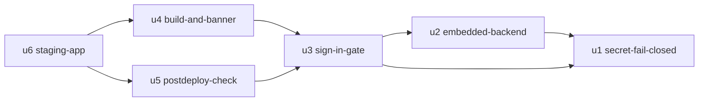

# Unit Dependencies — Dashboard Hosting Readiness

## Sources

- `unit-of-work.md`; `inception/domain-design/components.md` (component dependencies)
- Answers Q1–Q4 in `units-generation-questions.md`

This document describes topology only. Delivery Planning chooses the economic path through it.

## Dependency DAG



Text version (A depends on B):
- U2 depends on U1.
- U3 depends on U1 and U2.
- U4 depends on U3.
- U5 depends on U3.
- U6 depends on U4 and U5.

```yaml
units:
  - name: secret-fail-closed
    kind: library
    depends_on: []
  - name: embedded-backend
    kind: service
    depends_on: [secret-fail-closed]
  - name: sign-in-gate
    kind: ui
    depends_on: [secret-fail-closed, embedded-backend]
  - name: build-and-banner
    kind: ui
    depends_on: [sign-in-gate]
  - name: postdeploy-check
    kind: library
    depends_on: [sign-in-gate]
  - name: staging-app
    kind: packaging
    depends_on: [build-and-banner, postdeploy-check]
```

## Why each edge exists

| Edge | Reason |
|------|--------|
| U2 → U1 | The embedded backend calls `require_secret()` and verifies tokens with the call-time secret |
| U3 → U1 | The secrets bridge calls `require_secret()` |
| U3 → U2 | The dashboard's startup order (bridge, gate, backend) and Screen 4's sign-out tie the gate to the embedded start |
| U4 → U3 | The banner and build caption render only on the gate-allowed frame (Screen 3) |
| U5 → U3 | The check asserts the sign-in screen and imports its markers |
| U6 → U4, U5 | Staging is created only after every app change has merged, and it is proven with the check |

## Integration Points

| Between | Integration | Shape |
|---------|-------------|-------|
| U1 ↔ U2, U3 | `mock_hsm.auth.require_secret()`, `mint_token`, `verify_token` | In-process Python calls |
| U2 ↔ U3 | The embedded backend's address and status, read by the dashboard shell | In-process Python call (holder decided in Functional Design) |
| U3 ↔ U4 | The Screen 3 frame slots for the banner and build caption | Dashboard rendering |
| U3 ↔ U5 | `dashboard/markers.py` constants | Shared module (constants only) |
| U5 ↔ U6 | The check runs against the staging URL | HTTPS and a browser |

## Parallel Development Opportunities

U4 and U5 have no dependency on each other, so either order after U3 is valid. Q3 chose one unit at a time, so this is recorded as a valid alternative ordering, not a plan.

## Walking Skeleton

The first unit in DAG order, U1, is the integrated slice (Q2). It runs end to end before any later unit: its pull request merges with all 10 required checks green, and every entry point (backend, start script, hook, tool server) refuses to run without a secret while working with one. The local "dashboard shows the sign-in screen" part of the team's slice is checked when U3 completes.

## Assumptions & Open Questions

None.
