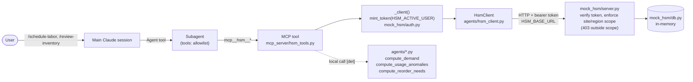
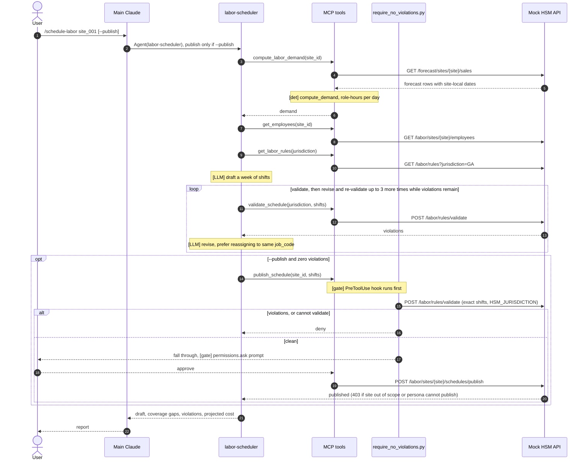
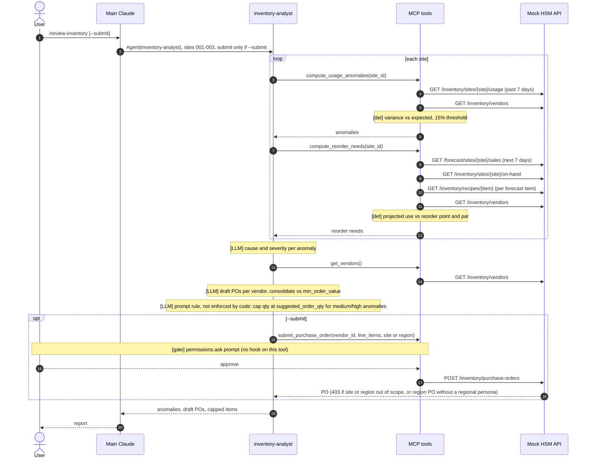
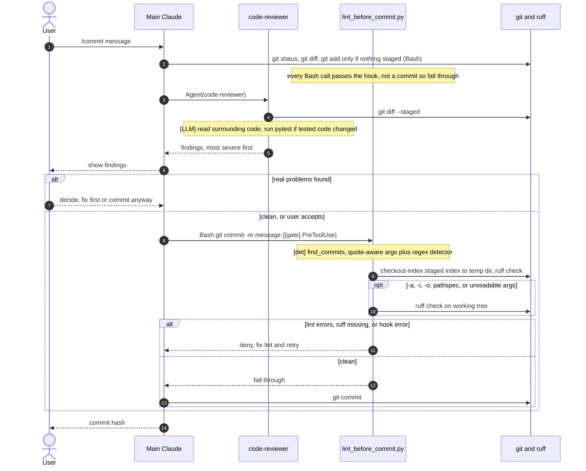

# Architecture: subagent call flows

How each subagent's work actually travels through Claude Code, the `hsm` MCP
server, and the mock HSM backend. The source of truth is the code; this
page is a map of it:

| Piece | Where |
|---|---|
| Slash commands | `.claude/commands/{schedule-labor,review-inventory,commit}.md` |
| Subagents + tool allowlists | `.claude/agents/{labor-scheduler,inventory-analyst,code-reviewer}.md` |
| Permission rules + hooks | `.claude/settings.json`, `.claude/hooks/*.py` |
| MCP tools | `mcp_server/hsm_tools.py` (registered in `.mcp.json`) |
| Deterministic math | `agents/labor_scheduling_agent.py`, `agents/inventory_agent.py` |
| HTTP client | `agents/hsm_client.py` (`HSM_BASE_URL`) |
| Mock backend | `mock_hsm/server.py`, `mock_hsm/db.py`, `mock_hsm/auth.py` |

Legend used in the sequence diagrams: **[det]** deterministic code,
**[LLM]** model judgment, **[gate]** a check that can block a write.

## Shared path for every HSM tool call

The deterministic functions run inside the MCP tool process, on data the
tool fetched through `HsmClient`. The tools never read data tables from
`mock_hsm.db`: the only local use is token minting, which looks the persona
up in its user table. Labor-rule validation is the exception to local
math: it runs server-side in `POST /labor/rules/validate`.

## labor-scheduler: `/schedule-labor <site_id> [--publish]`

Persona: Restaurant Manager scoped to the site (e.g. `user_rm_midtown`).

## inventory-analyst: `/review-inventory [--submit]`

Persona: Regional Manager for `region_atl` (`user_regional_atl`), sites
site_001 to site_003.

## code-reviewer: `/commit <message>`

No MCP tools. The reviewer has `Read, Grep, Glob, Bash` and no
`Edit`/`Write` tools. Its prompt says to only report, but with Bash that
is not enforced. The lint gate is the `PreToolUse` Bash hook, which sees
every Bash call and only acts on ones that look like a commit.

## Where writes are gated

| Write | `permissions.ask` | PreToolUse hook | Prompt rule |
|---|---|---|---|
| `publish_schedule` | yes | `require_no_violations.py` re-validates exact shifts | only with `--publish`, only at zero violations |
| `submit_purchase_order` | yes | none | only with `--submit`, cap anomalous materials |
| `git commit` | no | `lint_before_commit.py` | via `/commit` after review |

Hooks run before the permission prompt and only ever deny or fall through.
They never grant `allow`.
